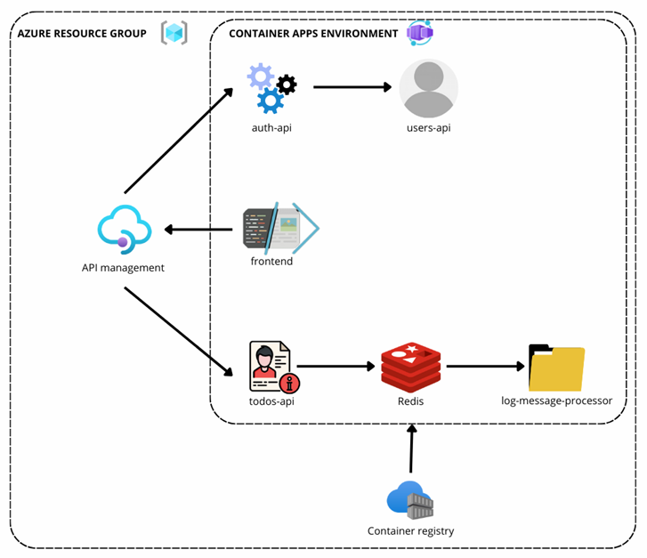
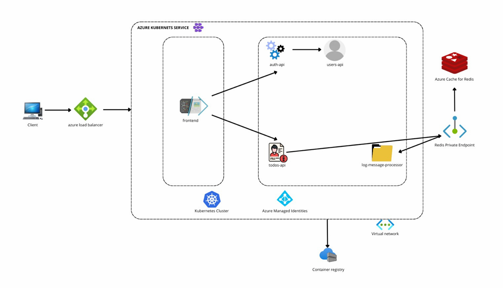

# Microservices Cloud Deployment – PRFT DevOps Training  
**By:** Jennifer Castro  
  

## Overview  
This repository contains the automation of both the **infrastructure** and **deployment pipelines** for the project [Microservice App Example](https://github.com/bortizf/microservice-app-example). The main goal of this exercise was to build a complete DevOps workflow capable of deploying, updating, and maintaining a microservices-based application in the cloud using **Terraform** and **GitHub Actions**.  

The solution was implemented in **Microsoft Azure**, using **Infrastructure as Code (IaC)** to ensure consistency and reproducibility across environments. The project emphasizes continuous integration and continuous deployment (CI/CD) principles, aligning both development and operations through automation.  

## Components  
The system is composed of several independent microservices:  

- **Auth API:** Handles user authentication and JWT token generation.  
- **Users API:** Manages user information and interactions.  
- **Todos API:** Provides CRUD operations for task management and logs events to Redis.  
- **Log Message Processor:** Consumes messages from Redis channels for background processing.  
- **Frontend:** Web application that provides the user interface and communicates with all APIs.  
- **Redis:** Used for in-memory data storage and asynchronous communication between services.  

Each service is containerized with Docker, ensuring portability and isolated deployment across environments.  

## Architecture  
The project follows a **microservices architecture** deployed entirely on Azure. The containers run inside **Azure Container Instances (ACI)** within a single container group to facilitate communication via `localhost`.  

All Docker images are stored in **Azure Container Registry (ACR)**, while **Azure API Management (APIM)** acts as the **API Gateway**, exposing a unified access point for the application and managing requests efficiently.  

Terraform modules were created for each major component (Resource Group, ACR, ACI, and APIM), enabling modular, reusable, and maintainable infrastructure code.  

## Branching Strategy for Development  
The development process follows the **GitHub Flow** model. Each new feature or fix is developed in a dedicated branch derived from `main`. When completed, the developer creates a pull request to merge the branch back into `main`.  

This strategy encourages continuous integration, minimizes merge conflicts, and supports the automation defined in the GitHub Actions workflows. Each change in `main` automatically triggers validation, build, and deployment processes.  

GitHub Flow is ideal for this project because it keeps the workflow simple and efficient while maintaining control and visibility over every change introduced in the repository.  

## Branching Strategy for Operations  
The operations team also follows **GitHub Flow**, maintaining consistency with the development workflow. All changes to the infrastructure —including updates to Terraform modules, variable files, or workflow definitions— are done in independent branches derived from `main`.  

Once the updates are ready, a pull request is opened for review and, after approval, merged into the main branch. This merge automatically triggers the **infrastructure pipeline**, which executes Terraform to apply the new configuration in Azure.  

Using the same branching model for both sides simplifies collaboration and version control, ensuring that infrastructure and application code evolve together under a single, cohesive strategy.  

## Infrastructure  
The infrastructure was implemented entirely with Terraform, structured in independent modules for clarity and reuse. The main resources provisioned include:  

- **Azure Resource Group:** Logical container for all deployed resources (`microservicesRgJenniferCastro`).  
- **Azure Container Registry (ACR):** Private registry for storing Docker images securely and efficiently.  
- **Azure Container Instances (ACI):** Hosts all microservices within one group, allowing internal communication and a single public entry point for the frontend.  
- **Azure API Management (APIM):** Provides API Gateway functionality, exposing all backend services through a unified and secured endpoint.  

This setup enables an organized, maintainable, and scalable deployment aligned with the principles of Infrastructure as Code (IaC).  

## Design Patterns  
Two cloud design patterns were incorporated to enhance system reliability and maintainability:  

**API Gateway Pattern:**  
Implemented using **Azure API Management**, which acts as a single entry point for all APIs. It allows centralized routing, authentication, rate limiting, and monitoring. This simplifies client integration and secures the system against unauthorized access.  

**Retry Pattern:**  
Applied at both infrastructure and application levels. At the infrastructure level, the `restart_policy = "Always"` parameter in ACI ensures automatic container restarts after transient failures. At the application level, environment variables such as `RETRY_ATTEMPTS` and `RETRY_DELAY` were introduced to allow controlled reattempts when dependent services (e.g., Redis or other APIs) are temporarily unavailable.  

Both patterns strengthen system resilience, ensuring stable communication and recovery from temporary failures.  

## Automation  
Automation is at the core of this project. All deployments are managed through **GitHub Actions**, which provide continuous integration and continuous delivery for both the infrastructure and the application code.  

The workflows are designed to detect changes automatically, validate configurations, and execute the corresponding Terraform or Docker commands, minimizing human intervention while maintaining full traceability.  

## Pipelines for Development  
The development pipeline is designed to work with a **monorepo** structure. It is triggered on every push or pull request and automatically identifies which microservice was modified.  

Once detected, it builds and tags the corresponding Docker image, pushes it to the **Azure Container Registry (ACR)**, and redeploys the updated container in **Azure Container Instances (ACI)**.  

This selective deployment process optimizes time and resources, ensuring that only the affected microservice is rebuilt and redeployed. It allows each service to evolve independently while maintaining system stability.  

## Pipelines for Infrastructure  
The infrastructure pipeline focuses exclusively on provisioning and managing cloud resources with Terraform. It runs on every push to the `main` branch or manually from the Actions tab.  

The workflow executes Terraform’s `init`, `validate`, `plan`, and `apply` stages, creating or updating the Azure resources defined in the configuration files. It uses GitHub Secrets to handle Azure authentication securely.  

Unlike the development pipeline, this workflow does not interact with Docker images or ACI containers; its sole responsibility is to maintain the underlying infrastructure.  

Together, both pipelines establish a fully automated CI/CD process that ensures a smooth integration between infrastructure and application layers.  

## Architecture  
The deployed architecture is fully container-based. All microservices run on **Azure Container Instances (ACI)** and share a private internal network. The **frontend** is exposed publicly through a dynamic IP, while backend services communicate internally. Redis serves as a shared cache and message broker between the todos-api and the log-message-processor.  

The **API Management** service is responsible for handling external client requests, enforcing security and routing them to the correct internal services. The **Container Registry** stores all images used in deployment, which are then pulled into ACI automatically when the infrastructure is created.  

Below is the current architecture diagram of the project:

## Future Architecture Vision  
Although Azure Container Instances works well for the current scale, I would recommend moving to **Azure Kubernetes Service (AKS)** in the future. Kubernetes would provide better scalability, health monitoring, and load balancing across replicas, which becomes essential as the system grows. AKS also integrates natively with other Azure services such as Managed Identities, Virtual Networks, and private endpoints — offering a more secure and enterprise-ready environment.  

With Kubernetes, I could implement autoscaling policies, rolling updates, and health probes, as well as more advanced patterns like circuit breaker and cache-aside. This change would turn the system into a fully orchestrated microservices platform, capable of handling production-grade workloads.  

The following diagram represents the improved, future version of the architecture:

